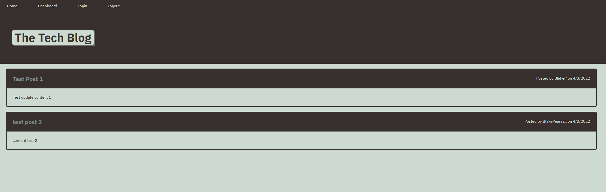

# MVC-Tech-Blog

## Description

This tech blog application will show posts from various users and allow other users to add comments. 

A user can create an account with their username and password and create multiple posts. 

Everything will be stored on the database

After a period of time idle, the user will be logged out and will prompt the user to log in again to make posts and comments

